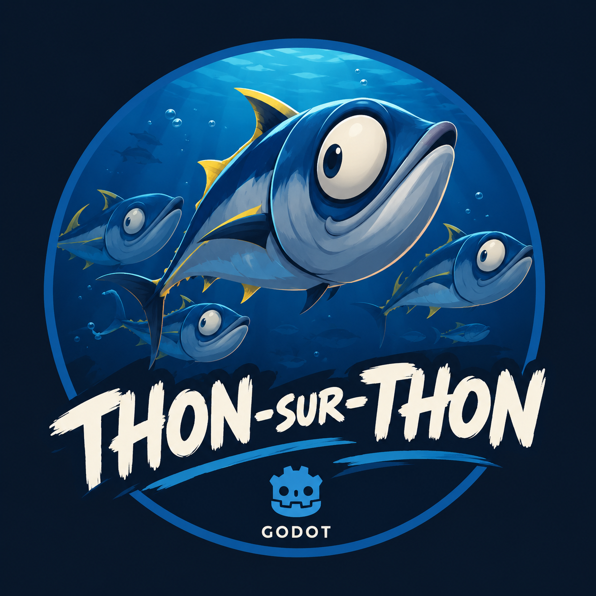

# Thon sur thon



Projet SMA – M2 ILIADE : un banc de thons en 3D (Godot) qui se disperse autour d'obstacles puis se reforme.

pas trop verbeux pour le code par IA

## Où trouver quoi

| Fichier | Contenu |
| --- | --- |
| [doc/idee-generale.md](doc/idee-generale.md) | Le projet en bref |
| [doc/versions.md](doc/versions.md) | Contenu et critères de fin de chaque version |
| [doc/feuille-de-route.md](doc/feuille-de-route.md) | Étapes et tâches à cocher |
| [doc/technique-mathematique.md](doc/technique-mathematique.md) | Les forces du thon et les mesures |
| [doc/technique-claude.md](doc/technique-claude.md) | Organisation avec les agents Claude Code |
| [PRATIQUES-GIT.md](PRATIQUES-GIT.md) | Branches, versions, commits |

## Voir la doc

```bash
cd doc
npm install
npm run dev
```
